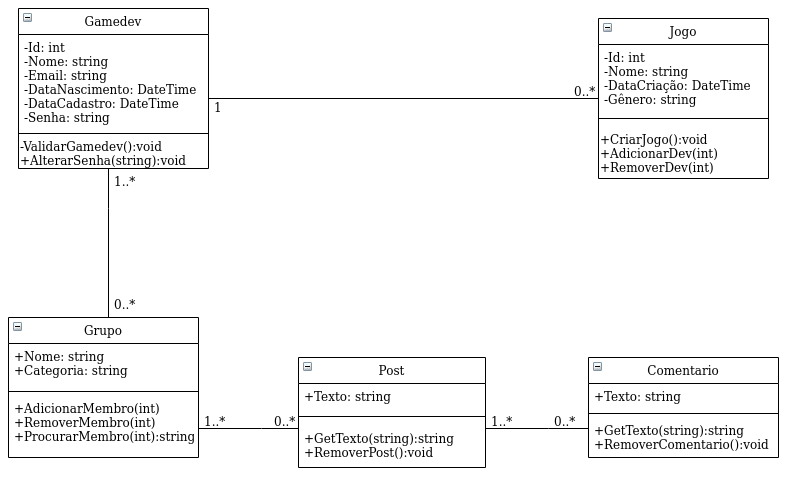
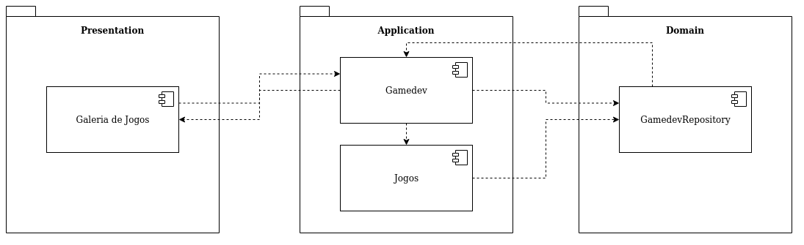

```
Aluno: Luan E. R. Almeida 
Professor: Júlio César Guimarães 
Disciplina: Projeto de Bloco | TP1, TP2, TP3, TP4, TP5
```
<br>

## Index

- [TP1](#)
  - [Requisitos de Usuário](#requisitos-de-usuário)
  - [CMMI](#modelo-integrado-de-maturidade-em-Capacitação-(CMMI))
- [TP2/TP3](#propósito-do-documento)
  - [Propósito do documento](#propósito-do-documento)
  - [Requisitos de Sistema](#requisitos-de-sistema)
- [TP4/TP5](#)
  - [Diagrama de Classe](#diagrama-de-classe)
  - [Diagrama de Componente](#diagrama-de-componente)
- [TP9](#)
  - [Relatório](#relatório)

<br>
<br>
<div align="center">
    <h1>TP1</h1>
</div>
<br>

## Requisitos de Usuário
* R01 - Registre os desenvolvedores<br>
O sistema deve pedir o nome, idade, endereço eletrônico e senha para que o usuário seja registrado.
<br>

* R02 - Registro do jogo<br>
O sistema deve pedir ao usuário qual o nome do jogo que ele está desenvolvendo.
<br>

* R03 - Sistema de postagem<br>
O usuário poderá enviar mensagens para que outros usuários os vejam.
<br>

* R04 - Sistema de comentário<br>
O usuário poderá comentar em mensagens já feitas.
<br>

* R05 - Sistema de criação de grupos<br>
O usuário poderá criar grupos onde as mensagens serão vistas apenas para os que pertencem ao grupo.
<br>

* R06 - Sistema de Galeria de Imagem<br>
O usuário poderá postar imagens formando uma galeria de imagens.
<br>

* R07 - Sistema de customização<br>
O usuário terá como customizar seu perfil.
<br>

* R08 - Sistema de Compartilhamento<br>
O usuário poderá compartilhar jogos (arquivos) com outros usuários.
<br>

* R09 - Sistema de Likes<br>
O sistema possibilitara o usuário a curtir posts.
<br>

* R10 - Sistema de amigos<br>
O sistema poderá adicionar gamedevs como amigos.
<br>


## Modelo Integrado de Maturidade em Capacitação (CMMI)

* Nível 1 - Inicial<br>
Os processos têm uma organização caótica, processos são imprevisível e reativos e há uma inexistência de padrões.
<br>

* Nível 2 - Gerenciado<br>
Os processos são planejados, medidos e há um controle. Os processos têm seus requisitos gerenciados.
<br>

* Nível 3 - Definido<br>
Os processos já estão bem definidos, proativo e menos reativo e os procedimentos são padronizados.
<br>

* Nível 4 - Gerenciado Quantitativamente<br>
Através de estatísticas e outras técnicas os processos são gerenciados quantitativamente, aumentando sua previsibilidade de desempenho.
<br>

* Nível 5 - Otimizado<br>
Os processos são flexibilizados para estar sendo melhorado continuamente. O processo é estabilizado aumentando a sua previsibilidade de resultado.
<br>
<br>
<br>
<div align="center">
    <h1>TP2/TP3</h1>
</div>
<br>

## Propósito do documento
Este documento visa categorizar as funcionalidades do produto. Definir as restrições das ferramentas, e tecnologias. Fornecer detalhes necessários para o desenvolvimento de uma estimativa e diagrama. Concretizar que as funcionalidades especificadas sejam parte do produto final. Retratar o conhecimento de maneira objetiva e descritiva. 

## Escopo do Projeto
Desenvolver uma rede social para desenvolvedores de jogos. Se você é desenvolvedor ou conhece a área você sabe a dificuldade que é encontrar uma equipe de desenvolvedores. Essa rede social tem em mente essa dificuldade, o nosso objetivo é dar a oportunidade de criar um ambiente de compartilhamentos de ideias e exposição para diversos desenvolvedores, para acharem produções em sintonia para trabalharem juntos na criação dos jogos.

<br>

## Requisitos de Usuário

#### R1. Criar Perfil
O perfil é onde o usuário tem suas informações básicas, competências e experiências descritas. É nele que devem existir ações de convidar para grupo.

#### R2. Galeria de Jogos
A galeria é onde o usuário tem a informação dos jogos desenvolvidos ou que serão desenvolvidos. Através de imagens como a capa do jogo ou ‘banner’.
Nela devem existir ações como a de publicar nova imagem ou exclui-la.

#### R3. Criar Grupos
Grupos são onde usuários se comunicam privadamente através de postagens. As postagens no grupo serão vistas apenas pelos usuários convidados.

#### R4. Criar  Posts
Posts é onde a comunicação entre usuários é feita. Posts são mensagens que poderão ser vistas por todos os usuários. Nela devem existir ações como a de publicar mensagem ou exclui-la.

#### R5. Comentários
Comentários são mensagens enviadas para outros usuários. É uma extensão dos posts onde o usuário poderá comentar em posts já feitos. Nele devem existir ações como a de publicar mensagem ou exclui-la.

     
<br>

## Requisitos de Sistema

### Requisito 1
| Requisitos              | Criar Perfil                                  |
| :---------------------- | :-------------------------------------------- |
| Atores                  | Usuário                                        |
| Pré-condição            | Não possuir um perfil na rede                 |
| Fluxo Básico            | <li>O usuário acessa a interface para criar o perfil. <li>O usuário informa seu nome.<li>O usuário informa seu e-mail.<li>O usuário informa sua data de nascimento.<li> O usuário informa as suas competências.<li>O usuário informa sua senha.<li>O usuário executa a criação do perfil.
| Pós condição            | <li> Um perfil é criado com as informações informadas.|
| Fluxo Alternativo       | <li> O usuário não informa um dos dados solicitados informados na interface. Quando isso ocorrer uma mensagem será mostrada, informando que o {dado} é obrigatório(a). Exemplo:<br>"Nome é obrigatório(a)."<li> O usuário informa um e-mail já registrado. Essa mensagem será mostrada: "O e-mail informado já está sendo usado."                |
| Dados                   |<li>Nome: Texto, Máximo de 100 caracteres, não pode conter números.<li> E-mail: Texto, Máximo de 100 caracteres.<li> Data de Nascimento: Data válida.<li>Competências: Texto, Máximo de 350 caracteres.                                           |
| Regras de validação |   <li>Validação de senha: O usuário deve fornecer os dados duas vezes.<li>Validação de e-mail: verificar formato e se o e-mail já consta na base de dados|

<br>

### Requisito 2
| Requisitos              | Galeria de Jogos |
| :---------------------- | :----------- |
| Atores                  | Usuário           |
| Pré-condição            | Possuir um perfil na rede<br>Possuir um endereço permitido pela rede social|
| Fluxo Básico            |<li> O usuário acessa a interface da Galeria de Jogos. <li> O usuário informa o endereço do arquivo.<li> O usuário executa a publicação.      |
| Pós condição            | <li> Uma foto é publicada na Galeria de Jogos.             |
| Fluxo Alternativo       | <li> O usuário informa endereço inválido. Quando isso ocorrer será mostrada a seguinte mensagem:<br>"O endereço informado é inválido."<li> O usuário executa a exclusão da imagem. Quando isso ocorrer o usuário excluirá a imagem escolhida.|
| Dados                   |     <li> Endereço do arquivo: Texto, Máximo 200 caracteres.        |
| Regras de validação| <li>Validação de endereço: link deve terminar com um formato de imagem, por exemplo: png, jpg.|

<br>

### Requisito 3
| Requisitos              | Criar Grupos |
| :---------------------- | :--------------- |
| Atores                  | Usuário           |
| Pré-condição            | Possuir um perfil na rede<br>Endereço de perfil do convidado|
| Fluxo Básico            |<li> O usuário acessa a interface de grupos<li> O usuário informa o nome do grupo.<li> O usuário informa ao menos um endereço de perfil convidado.<li> O usuário executa a criação do grupo.            |
| Pós condição            |  <li> Um grupo é criado com as informações informadas.                |
| Fluxo Alternativo       | <li> O usuário não informa o endereço de perfil do convidado ou endereço de perfil não existe. Quando isso ocorrer será exibida a seguinte mensagem:<br>"O endereço fornecido é inválido ou não existe"|
| Dados               |  <li>Nome do Grupo: Texto, Máximo 100 caracteres.<li>Endereço do Convidado: Texto, Máximo 200 caracteres.               |
| Regras de validação | <li>Validação de endereço: verifica se endereço fornecido é inválido ou não existe.                 |

<br>

### Requisito 4
| Requisitos              | Criar Posts |
| :---------------------- | :--------------- |
| Atores                  | Usuário|
| Pré-condição            | Possuir um perfil na rede|
| Fluxo Básico            | <li>O usuário acessa a interface de posts.<li>O usuário informa uma mensagem.<li>O usuário executa a criação do post.|
| Pós condição            | Uma mensagem é publicada.|
| Fluxo Alternativo       |<li>O usuário não preenche o campo de mensagem. Quando isso ocorrer uma mensagem será mostrada: <br>"O campo de mensagem está vazio."<li>O usuário executa o campo de exclusão. Quando isso ocorrer a mensagem pertencente ao campo é excluída.|
| Dados                   |<li>Mensagem: Texto, Máximo 240 caracteres.|
| Regras de validação | <li>Validação de campo: verifica se o campo está vazio.|

<br>

### Requisito 5
| Requisitos              | Registro de Gamedev |
| :---------------------- | :--------------- |
| Atores                  | Usuário           |
| Pré-condição            | Possuir E-mail válido.|
| Fluxo Básico            | <li> O usuário acessa a a página de registro.<li>O usuário informa e-mail válido e senha.<li> O usuário executa a criação de conta. |
| Pós condição            |Registro de usuário é criado.             |
| Fluxo Alternativo       | <li>O usuário não preenche o campo de E-mail ou senha. Quando isso ocorrer uma mensagem será mostrada: <br>"O campo de E-mail/Senha está vazio."<li>O usuário preenche o campo de E-mail ou senha com caracteres inválidos. Quando isso ocorrer uma mensagem será mostrada: <br>"O campo de E-mail/Senha são inválidos."<li>O usuário já está registrado. <br> Terá a opção de fazer login com conta já registrada.|
| Dados                   | E-mail: Texto, Máximo 240 caracteres.|
| Regras de validação |<li>Validação de campo: verifica se o campo está vazio.<br><li>Validação de campo: verifica se email/senha são válidos.|

<br>

## Matriz de Rastreabilidade

|Requisito|[R1] - Perfil|[R2] - Galeria|[R3] - Grupos|[R4] - Posts|[R5] - Registrar
|:-----  |:-----: |:-----:|:-----:|:-----:|:-----:|
|[R1] - Perfil |      |       |      |      | [X]     |      |  
|[R2] - Galeria|  [X]   |       |      |  [X]    |     [X] |      |  
|[R3] - Grupos|  [X]   |       |      |  [X]   |  [X]   |      |  
|[R4] - Posts|  [X]   |       |      |      |    [X]  |      |  
|[R5] - Registrar|     |       |      |    |      |      |  
<br>

## Público-Alvo
* Desenvolvedores de jogos
* Homens e Mulheres, de 18 a 45 anos
* Graduados e não graduados
* Interessados em conhecer pessoas para que se crie um grupo de desenvolvedores
* Aficionados por jogos


<br>
<br>
<div align="center">
    <h1>TP4/TP5</h1>
</div>
<br>

## Diagrama de Classe


<br>

## Diagrama de Componente



<br>
<br>

<div align="center">
    <h1>TP9</h1>
</div>
<br>
<br>

## Relatório

<p>O modelo em cascata não é algo novo, pelo contrário, já é concretizado um método seguro de desenvolvimento. Quando o professor nos explicou o conceito, achei que iria ser nada de mais, subestimei a sua complexidade, que com o tempo se transformou em um grande "quebra-cabeça", que quando as peças se encontraram começam a fazer sentido.
Cada coisa tem seu lugar e em longo prazo a sua complexidade é recompensada por mais segurança e organização. <p/> Em pensar em construir uma rede social logo fiquei animado e cheio de ideias e expectativas, me superestimei, pensei em planos e mais planos, e logo cai com a cara no chão quando comecei as aulas. No final tentei criar um fundamento sólido, e com dificuldade consegui os seguintes resultados. Minha rede social simples, mas faz seu trabalho. Com a ajuda do identity rapidamente um meio de autenticação, e com certeza não aproveitei os recursos de customização. Depois segui a minha ideia inicial de formar um pequeno "fórum" com a tela de postagem, não é nada grandioso mas faz seu trabalho. Com a simples tela de perfil onde tive dificuldade em trafegar a imagem do usuário, é lá que seus dados pessoais são registrados. <p>Minhas expectativas fazem com que o produto final se pareça medíocre, e pode até ser, mas vejo ele como uma zona de estudo que não irei esquecer.
